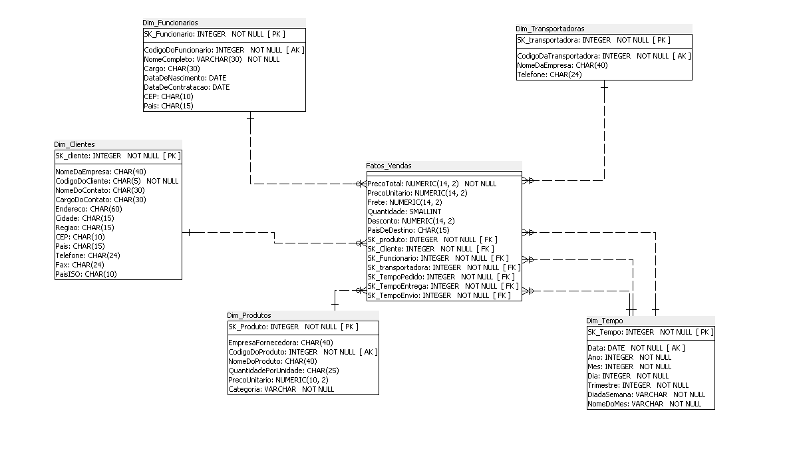

# 🌍 **Northwind**  

## 👥 **Equipe**  
- **Alic Victor**  
- **Juliana Ferreira**  
- **Márcio José**  
- **Ricardo Luis** 

## 📌 **Visão Geral**  
Este modelo dimensional segue a abordagem **Esquema Estrela**, onde a **tabela fato** (`Fatos_Vendas`) contém os dados quantitativos e as **tabelas dimensão** (`Clientes`, `Tempo`, `Produtos`, `Pedidos`, etc.) fornecem o contexto para análise.  

Ele foi projetado para facilitar consultas analíticas e gerar insights sobre vendas, desempenho de funcionários, eficiência logística e segmentação de clientes.  

# 📊 Modelo Dimensional - Esquema Estrela  

Este modelo segue a abordagem de **Esquema Estrela**, onde há uma **tabela fato** (`Fatos_Vendas`) que armazena métricas e indicadores de vendas, e várias **tabelas dimensão** (`Clientes`, `Tempo`, `Produtos`, `Pedidos`, etc.), que permitem a análise dos dados sob diferentes perspectivas.  

## 🔹 Avaliação do Modelo  

### **1️⃣ Tabela Fato (`Fatos_Vendas`)**  
✅ Contém as métricas principais: `PrecoUnitario`, `Quantidade`, `Desconto`, `PaisDeDestino`.  
✅ Referencia dimensões importantes (`SK_Tempo`, `SK_Cliente`, `SK_Funcionario`, `SK_Pedido`, `COD_produto`), permitindo análises baseadas no tempo, cliente, funcionário, pedido e produto.  
✅ O uso de `NUMERIC(14,2)` para valores monetários evita problemas de precisão.  
🔹 **Sugestão**: Poderia incluir um campo `Total_Venda` calculado (`PrecoUnitario * Quantidade - Desconto`) para facilitar consultas.  

### **2️⃣ Dimensão Tempo (`Tempo`)**  
✅ Permite análises temporais detalhadas (Ano, Mês, Dia, Trimestre, Dia da Semana, Nome do Mês).  
✅ O uso de `SK_Tempo` como chave substituta é adequado para eficiência.  
✅ O índice na coluna `Data` melhora a performance de consultas baseadas no tempo.  

### **3️⃣ Dimensão Clientes (`Clientes`)**  
✅ Contém informações sobre os clientes, permitindo segmentação por localização (`PaisISO`, `Cidade`, `Regiao`) e dados de contato.  
🔹 **Sugestão**: O uso de `CHAR` para `CodigoDoCliente` é apropriado, mas os demais campos poderiam ser `VARCHAR` para reduzir espaço em disco.  

### **4️⃣ Dimensão Fornecedores (`Fornecedores`)**  
✅ Foca no nome do fornecedor e contato, relacionando-se com `Produtos`.  
🔹 **Sugestão**: Poderia incluir localização para análises geográficas.  

### **5️⃣ Dimensão Transportadoras (`Transportadoras`)**  
✅ Permite avaliar transportadoras responsáveis pelos pedidos.  
🔹 **Sugestão**: `SK_transportadora` foi definida como `VARCHAR`, mas deveria ser `INTEGER` para manter consistência com outras dimensões.  

### **6️⃣ Dimensão Pedidos (`Pedidos`)**  
✅ Relaciona diferentes tempos (`SK_TempoPedido`, `SK_TempoEnvio`, `SK_TempoEntrega`), possibilitando análises de eficiência logística.  
✅ `NumeroDoPedido` tem um índice único, melhorando performance em consultas.  

### **7️⃣ Dimensão Categorias (`Categorias`)**  
✅ Permite análises por tipo de produto.  
🔹 **Sugestão**: `Descricao` usa `CHAR(300)`, o que pode desperdiçar espaço. Um `TEXT` seria mais adequado.  

### **8️⃣ Dimensão Produtos (`Produtos`)**  
✅ Relaciona produtos com fornecedores e categorias.  
✅ `PrecoUnitario` está corretamente armazenado como `NUMERIC(10,2)`.  

### **9️⃣ Dimensão Funcionários (`Funcionarios`)**  
✅ Permite análises por cargo, país e tempo de serviço.  

# Modelagem Dimensional
###  Modelo Estrela

# 📊 Relatório de Métricas da Análise do Negócio

## 📌 Sumário

| #  | Métrica / Análise | Medida | Dimensão | Observação |
|----|----------------------|--------|----------|------------|
| 1  | **Top 10 Clientes (Vendas)** | Total de vendas (quantidade * preço unitário) | Cliente | Ordenado do maior para o menor |
| 2  | **Top 10 Produtos por Categoria** | Total de vendas (quantidade) | Categoria, Produto | Hierarquia: Categoria → Produto |
| 3  | **Produtos mais vendidos na Alemanha** | Total de vendas (quantidade) | Produto, País | Apenas clientes da Alemanha |
| 4  | **Categoria mais representativa nos EUA** | Total de vendas (quantidade * preço unitário) | Categoria | Apenas clientes dos EUA |
| 5  | **Vendas detalhadas por Vendedor** | Quantidade vendida, Desconto, Preço Unitário | Vendedor, Cliente | Hierarquia: Vendedor → Cliente |
| 6  | **Vendedores que mais dão descontos** | Total de descontos concedidos | Vendedor | Ordenado do maior para o menor |
| 7  | **Quantidade de Clientes por País** | Contagem de clientes | País | Contagem total |
| 8  | **Quantidade de Produtos por Categoria** | Contagem de produtos | Categoria | Contagem total |
| 9  | **Fornecedores mais vendidos na categoria Bebidas** | Total de vendas (quantidade * preço unitário) | Fornecedor | Apenas produtos da categoria "Bebidas" |
| 10 | **Evolução Mensal das Vendas (1997)** | Total de vendas (quantidade * preço unitário) | Mês/Ano | Apenas para o ano de 1997 |
| 11 | **Tempo Médio de Entrega por Transportadora (1997)** | Tempo médio de entrega | Transportadora | Apenas pedidos de 1997 |
| 12 | **Distribuição de Vendedores por País** | Contagem de vendedores | País | Contagem total |
| 13 | **Cidades que mais consomem "Côte de Blaye"** | Total de vendas (quantidade) | Cidade | Apenas para o produto "Côte de Blaye" |
| 14 | **Vendedores que participaram nas vendas do principal cliente** | Quantidade de vendas realizadas | Vendedor | Apenas para o principal cliente |
| 15 | **Fornecedores vinculados ao principal cliente** | Quantidade de produtos fornecidos | Fornecedor | Apenas fornecedores envolvidos |
| 16 | **Produtos mais vendidos para o principal cliente** | Total de vendas (quantidade) | Produto | Apenas para o principal cliente |
| 17 | **Categorias, Produtos mais vendidos e Clientes** | Total de vendas (quantidade) | Categoria, Produto, Cliente | Hierarquia: Categoria → Produto → Cliente |
| 18 | **Clientes do Brasil com informações detalhadas** | - | Empresa, Contato, Cidade, Estado, Telefone, Fax | Apenas clientes do Brasil |
| 19 | **Pedidos atendidos por Transportadora (1996-1998)** | Contagem de pedidos | Transportadora, Ano | Hierarquia: Ano → Transportadora |
| 20 | **Ticket Médio por Pedido (Geral, Cliente, País, Cidade)** | Média do valor total do pedido | Cliente, País, Cidade | Hierarquia: País → Cidade → Cliente |
| 21 | **Transportadoras com Melhor Tempo de Entrega** | Tempo médio de entrega | Transportadora | Ordenado do menor para o maior tempo |
| 22 | **Tempo Médio para Liberação de Produtos** | Tempo médio de liberação | - | Média do tempo entre pedido e envio |
| 23 | **Vendedores e respectivos Tickets Médios por Pedido** | Ticket médio por pedido | Vendedor | Média do valor total dos pedidos |
| 24 | **Produtos sem movimentação de venda** | - | Produto | Produtos sem registros na tabela de vendas |
| 25 | **Categorias de Produtos que mais recebem descontos** | Total de descontos concedidos | Categoria de Produto | Ordenado do maior para o menor desconto total |
| 26 | **Tendência de Faturamento com base no histórico de vendas** | Total de faturamento mensal | Mês/Ano | Ordenado por mês |
| 27 | **Clientes com perfil de consumo similar** | Quantidade de produtos em comum | Cliente1, Cliente2 | Clientes que compram produtos similares (> 5 itens em comum) |

# Diretoria

| Pergunta | Medidas | Dimensões | Hierarquia | Observações |
|---|---|---|---|---|
| Ticket médio por pedido | Média do valor total do pedido | Pedido | - | Soma do valor total dos pedidos dividido pelo número de pedidos |
| Faturamento médio por cliente | Média do faturamento por cliente | Cliente | - | Soma do faturamento dividido pelo número de clientes |
| Qtde de clientes atendidos | Contagem de clientes distintos | Cliente | - | Número total de clientes que realizaram pelo menos uma compra |
| Tempo médio de entrega pela transportadora | Média do tempo de entrega (diferença entre data de envio e data de entrega) | Transportadora | - | Tempo médio entre o envio e a entrega dos pedidos |
| Tempo médio para liberação do pedido para transportadora | Média do tempo de liberação (diferença entre data do pedido e data de envio) | - | - | Tempo médio entre o registro do pedido e o envio para a transportadora |
| Faturamento geral | Soma do valor total dos pedidos | - | - | Valor total das vendas realizadas |

